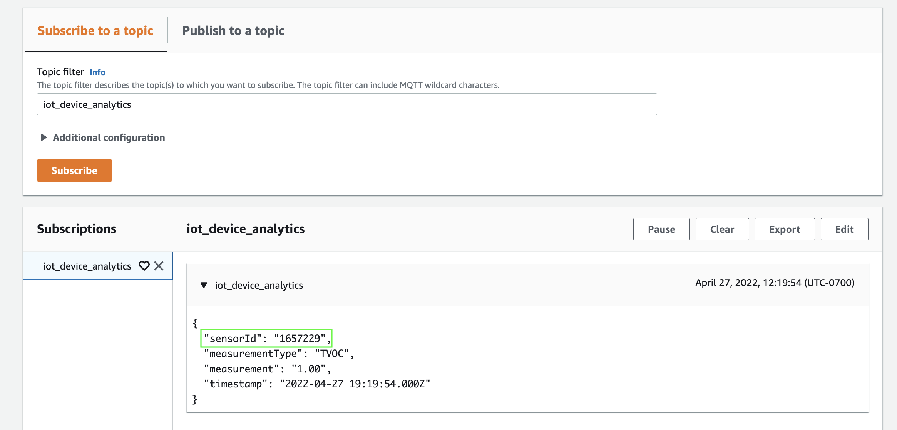

# Arduino Setup (software)

## Step 1: Install the Arduino IDE
Download [Arduino IDE](https://www.arduino.cc/en/software)
* Select instructions from [here](https://www.arduino.cc/en/Guide) based on OS

## Step 2: Board Selection
### Install the NodeMCU ESP8266 Board
This board is not supported by the basic board manager that is automatically installed with the IDE.  We will need to install a new board manager.
1. In the IDE, go to File->Preferences, and paste the following url into the *Additional Boards Manager URLs*, then click **OK**:
```
http://arduino.esp8266.com/stable/package_esp8266com_index.json
```

2. Go to Tools->Board->Boards Manager, and search for esp8266.  When you install this, select the 2.7.4 version.

3. Go to Tools->Board->ESP8266 Boards (2.7.3) and select *NodeMCU 1.0 (ESP-12E Module)*.

## Step 3: Installing the ESP8266 File System Uploader
The certificates and keys that we downloaded in the previous section need to now be uploaded to the board. This is done using the [following plugin](https://github.com/esp8266/arduino-esp8266fs-plugin). The Github page provides the necessary instructions for installation.

1. Once installation is finished, navigate to the Arduino directory where your sketch is saved. Open it and create a new directory called ‘data’. Paste the 'cert', 'private', and 'ca' files in there. 


3. Open up the 'aws_sensor_authentication.ino' sketch. Go to Tools -> Sketch Data Upload. This should start uploading the files into ESP8266 flash file system. When done, IDE status bar will display SPIFFS Image Uploaded message.


## Step 4: Installing the libraries
The following libraries need to be installed onto the Arduino IDE in order to for the sketch to compile and be uploaded to the board. You can use the 'Library Manager' in the IDE and install them. 

- The following are installed by going into the IDE, then clicking on Sketch -> Library Manager -> 'Library Name' and then install. 
  - PubSub Client by Nick O' Leary (v. 2.8.0)
  - NTP Client by Fabrice Weinberg (v. 3.2.1)
  - DFRobot CCS811 by Fary DF Robot (v. 1.0.1)
  - ArduinoJSON by Benoit Blanchon (v. 6.19.4)
  - WiFiManager by tablatronix (v. 2.0.11-beta)

# Arduino Setup (hardware)
### NodeMCU ESP8266
For this step, you will need some wires and a breadboard, as well as the CCS811 sensor and NodeMCU ESP8266 board.  Colour-coding the wires is highly recommended, particularly for ground and power wires.  In the example below, black is ground, red is power, blue is SDA, and green is SCL.

1. Place the chip and Arduino on a breadboard.


2. Connect the GND pin on the chip to a GND pin on the Arduino (note that there are multiple GND pins on the Arduino, it doesn't matter which one you choose).


3. Connect the VCC pin on the chip to the 3V3 pin on the Arduino.


4. Connect the SDA pin on the chip to the D2 pin on the Arduino.


5. Connect the SCL pin on the chip to the D1 pin on the Arduino.


6. Connect the WAKE pin on the chip to a GND pin on the Arduino (again, doesn't matter which GND pin you choose).


7. Once setup, connect the Micro USB cable to your device and plug it into your laptop. 


# Connecting the Sensor to the Cloud
1. The code file we will be working with is the [Arduino sketch in this directory](../src/NodeMCU/aws_sensor_connection_with_authentication/aws_sensor_connection_with_authentication.ino). Download the file, open it up in the Arduino IDE and change the endpoint and topic values.


2. From the Menu bar, select Tools -> Port. If a board is currently selected it will be displayed here. If you don't see your board in the list, checkout [this link](https://support.arduino.cc/hc/en-us/articles/4412955149586-If-your-board-does-not-appear-in-the-port-menu). Although the Port varies by system, the rest of your Tools configurations should look something like this.


4. Click the upload button and wait for your sketch to be uploaded to the board (Might take a few minutes). 

5. Open up the serial monitor which is set at the baud rate of 115200.

6. Using any WiFi enabled device, find the access point called ESP8266APConnect and click connect.


7. You will be directed to a landing page where you can find your configure your WiFi credentials (SSID/WiFi Name and WiFi Password). Once configured, the page will close and you will get confirmation in the 'Serial Monitor' that your device has successfully connected and sending data in the Serial Monitor.


8. We can test this by opening up the MQTT Test Client in the AWS IOT Core Console. Enter the topic name in the field, click subscribe, and see the TVOC and CO2 readings show up. 



