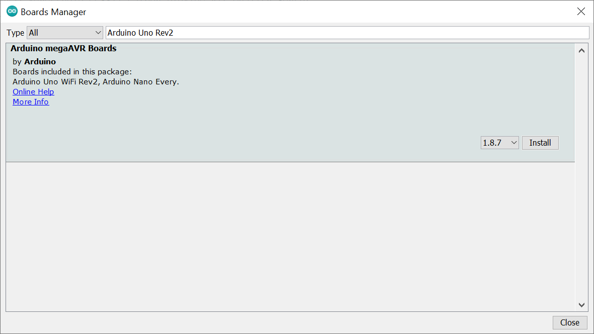
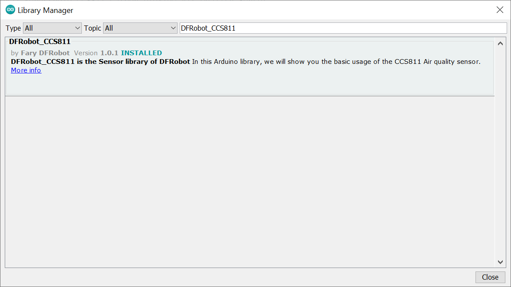
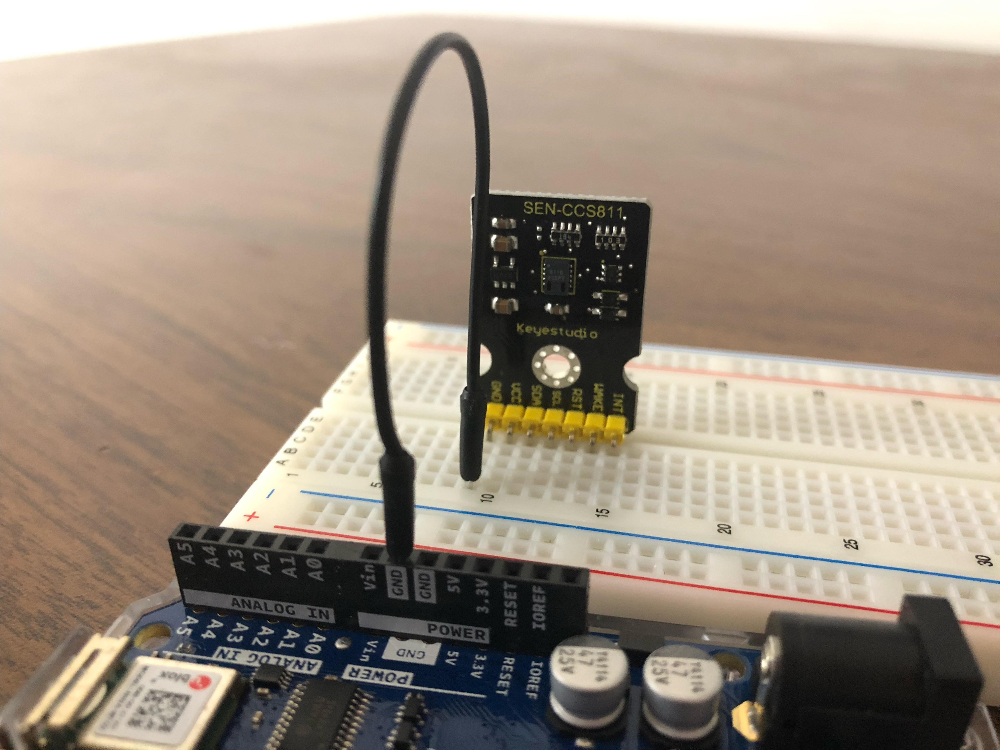
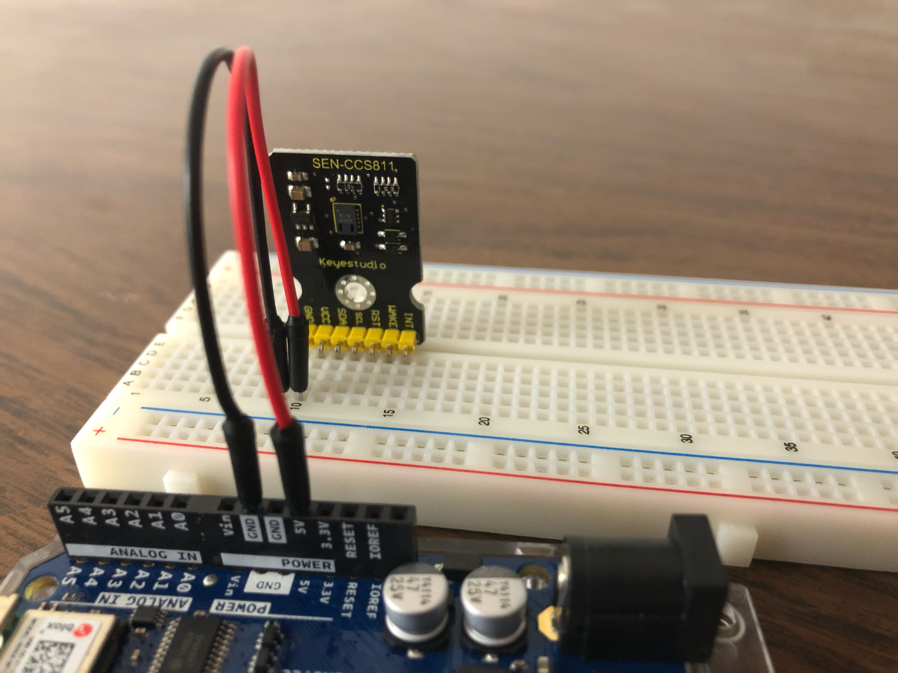
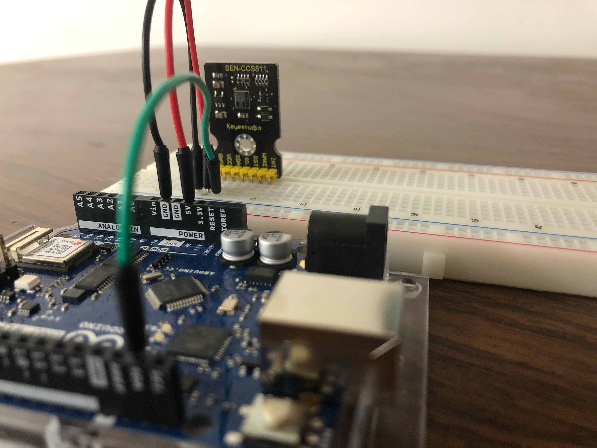
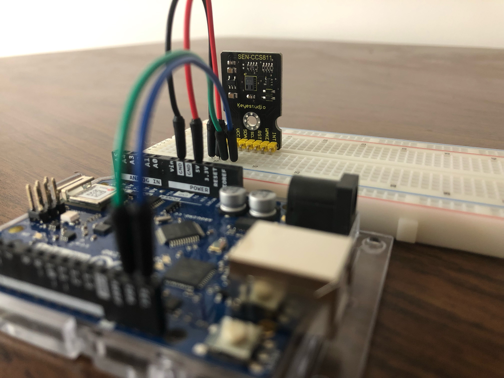
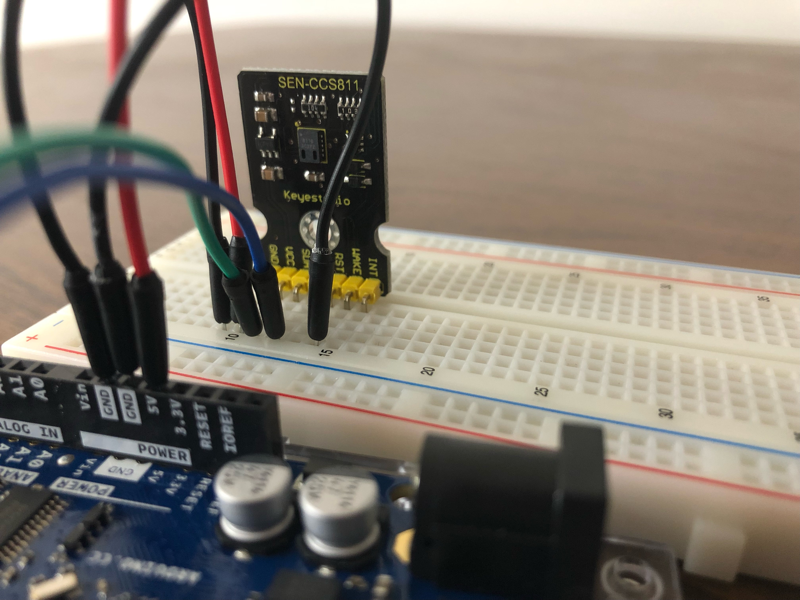

# Arduino Setup

## Step 1: Install the Arduino IDE
Download [Arduino IDE](https://www.arduino.cc/en/software)
* Select instructions from [here](https://www.arduino.cc/en/Guide) based on OS

## Step 2: Set up the IDE
Before we can run any code on the Arduino, there are a few things to set up.

### Step 2.1: Board Selection
The board we want to use is the Arduino Uno Rev2 Wifi, which is not supported by the basic board manager that is automatically installed with the IDE.  We will need to install a new board manager.
1. In the Arduino IDE, go to Tools->Board->Boards Manager.
2. In the Boards Manager, type "Arduino Uno Rev2" into the search bar.  This should bring up a board manager called *Arduino megaAVR Boards*.  Install this.

3. Go to Tools->Board->Arduino Mega AVR Boards and select *Arduino Uno Wifi Rev2*.

### Step 2.2: Install a Libary
To use the current code, the DFRobot_CCS811 library is required.
1. In the Arduino IDE, go to Sketch->Include Libary->Manage Libraries.
2. In the Library Manager, type "DFRobot_CCS811" into the search bar.  Install the library.

## Step 3: Test the Arduino
To make sure everything is working correctly, follow [this](https://learn.adafruit.com/adafruit-arduino-lesson-1-blink/the-l-led?view=all) guide to make an LED blink.

## Step 4: Create the CCS811-Arduino Circuit
For this step, you will need some wires and a breadboard, as well as the CCS811 sensor and Arduino board provided by the CIC.  Colour-coding the wires is highly recommended, particularly for ground and power wires.  In the example below, black is ground, red is power, blue is SDA, and green is SCL.

1. Place the chip on a breadboard.

2. Connect the GND pin on the chip to a GND pin on the Arduino (note that there are multiple GND pins on the Arduino, it doesn't matter which one you choose).

3. Connect the VCC pin on the chip to the 5V pin on the Arduino.

4. Connect the SDA pin on the chip to the SDA pin on the Arduino.

5. Connect the SCL pin on the chip to the SCL pin on the Arduino.

6.  Connect the WAKE pin on the chip to a GND pin on the Arduino (again doesn't matter which GND pin you choose).

## Step 5: Test the CCS811 Sensor
The test code provided [here](../tests/test_CCS811/test_CCS811.ino) will read from the sensor every second and print the results to the serial output.

1. Connect the Arduino board with the circuit from **Step 4** to your laptop using the USB blaster cord.

2. Open the Arduino IDE.

3. Go to File->Open, and select the tests/test_CCS811/test_CCS811.ino file from this repo.  This will open a new window.

4. Upload the code to the Arduino, the way you did for the Blink example in **Step 3**.

5. Open the Serial Monitor.  Make sure the baud rate is set to 115200, since that is what the code uses.

## Step 6: Run the Sensor Code
This step if for running the code to take CO2 and TVOC readings and send them to an AWS IOT endpoint.

1. Repeat all steps in **Step 5**, but select the src/CCS811/CCS811.ino instead.

#TODO: update this step