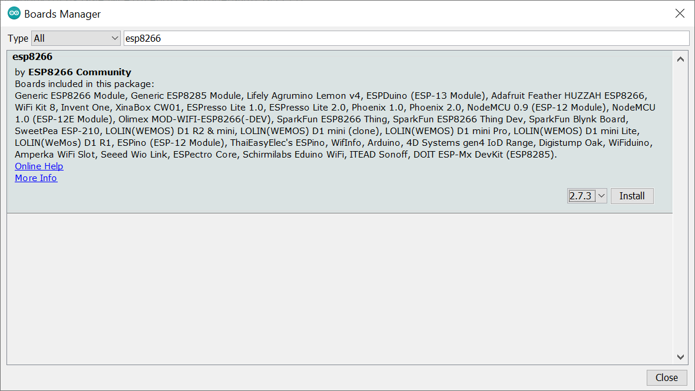
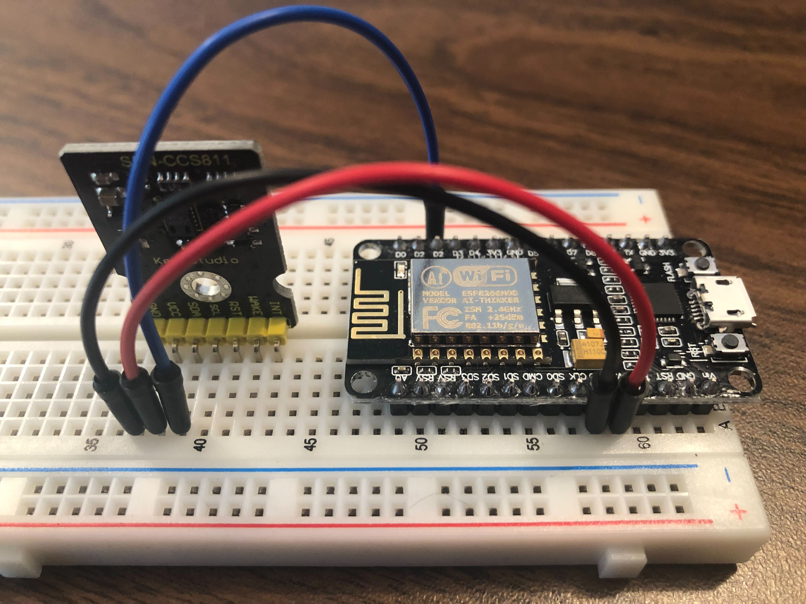

# Arduino Setup

## Step 1: Install the Arduino IDE
Download [Arduino IDE](https://www.arduino.cc/en/software)
* Select instructions from [here](https://www.arduino.cc/en/Guide) based on OS

## Step 2: Board Selection
### Arduino Uno Rev2 Wifi
This board is not supported by the basic board manager that is automatically installed with the IDE.  We will need to install a new board manager.
1. In the Arduino IDE, go to Tools->Board->Boards Manager.
2. In the Boards Manager, type "Arduino Uno Rev2" into the search bar.  This should bring up a board manager called *Arduino megaAVR Boards*.  Install this.


3. Go to Tools->Board->Arduino Mega AVR Boards and select *Arduino Uno Wifi Rev2*.

### NodeMCU ESP8266
This board also is not supported by the basic board manager.
1. In the IDE, go to File->Preferences, and paste the following url into the *Additional Boards Manager URLs*, then click **OK**:
```
http://arduino.esp8266.com/stable/package_esp8266com_index.json
```

2. Go to Tools->Board->Boards Manager, and search for esp8266.  When you install this, select the 2.7.3 version: later versions are not compatible with the libraries used for the MQTT messaging code.

3. Go to Tools->Board->ESP8266 Boards (2.7.3) and select *NodeMCU 1.0 (ESP-12E Module)*.

### Step 3: Install a Libary
To use the current code, the DFRobot_CCS811 library is required.
1. In the Arduino IDE, go to Sketch->Include Libary->Manage Libraries.
2. In the Library Manager, type "DFRobot_CCS811" into the search bar.  Install the library.


## Step 4: Test the Arduino
To make sure everything is working correctly, follow [this](https://learn.adafruit.com/adafruit-arduino-lesson-1-blink/the-l-led?view=all) guide to make an LED blink.

## Step 5: Create the CCS811-Arduino Circuit
### Arduino Uno Rev2 WiFi
For this step, you will need some wires and a breadboard, as well as the CCS811 sensor and Arduino Uno Rev2 WiFi board.  Colour-coding the wires is highly recommended, particularly for ground and power wires.  In the example below, black is ground, red is power, blue is SDA, and green is SCL.

1. Place the chip on a breadboard.


2. Connect the GND pin on the chip to a GND pin on the Arduino (note that there are multiple GND pins on the Arduino, it doesn't matter which one you choose).


3. Connect the VCC pin on the chip to the 5V pin on the Arduino.


4. Connect the SDA pin on the chip to the SDA pin on the Arduino.


5. Connect the SCL pin on the chip to the SCL pin on the Arduino.


6.  Connect the WAKE pin on the chip to a GND pin on the Arduino (again, doesn't matter which GND pin you choose).


### NodeMCU ESP8266
For this step, you will need some wires and a breadboard, as well as the CCS811 sensor and NodeMCU ESP8266 board.  Colour-coding the wires is highly recommended, particularly for ground and power wires.  In the example below, black is ground, red is power, blue is SDA, and green is SCL.

1. Place the chip and Arduino on a breadboard.


2. Connect the GND pin on the chip to a GND pin on the Arduino (note that there are multiple GND pins on the Arduino, it doesn't matter which one you choose).


3. Connect the VCC pin on the chip to the 3V3 pin on the Arduino.


4. Connect the SDA pin on the chip to the D2 pin on the Arduino.


5. Connect the SCL pin on the chip to the D1 pin on the Arduino.


6.  Connect the WAKE pin on the chip to a GND pin on the Arduino (again, doesn't matter which GND pin you choose).
