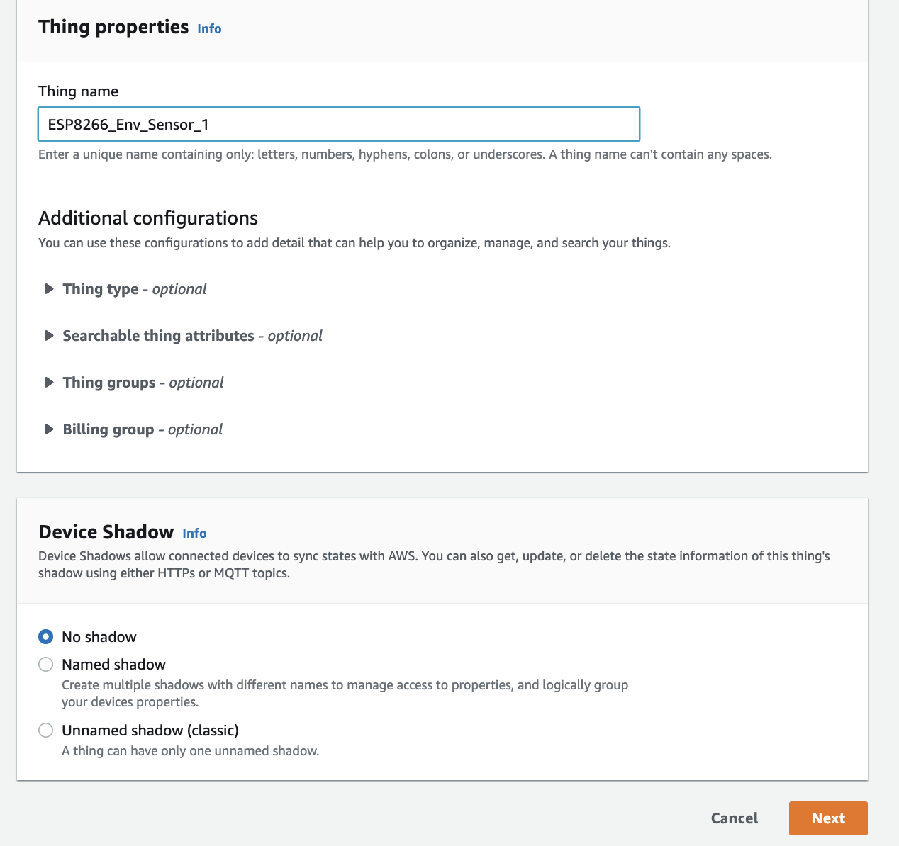

# Creating and provisioning a Thing in the AWS Console

## Step 1: Create a Thing in the AWS IOT Console and download the certificates

1. Open up your AWS console, search for and go to the IOT Core service. Then click on the Things link under the Manage section.


2. Click on Create Things -> Create one thing


3. Give your device a name, leave all other configurations as they are and select 'Next'. 


4. On the next page, make sure ‘Auto-generate a new certificate’ is selected and select 'Next'.

5. In the policies page, click on ‘Create Policy’. Give your policy a name and copy paste the following JSON schema into the policy builder. Once inserted, click 'Create'.
    ```
    {
    "Version": "2012-10-17",
    "Statement": [
        {
        "Action": "iot:Connect",
        "Resource": "*",
        "Effect": "Allow"
        },
        {
        "Action": [
            "iot:Publish",
            "iot:Subscribe",
            "iot:Receive"
        ],
        "Resource": "*",
        "Effect": "Allow"
        }
    ]
    }
    ```
     

6. Now select your newly created policy, and select Create Thing. You will be presented with the following prompt, ensure you download the Device Certificate, Private Key and the Amazon Root CA 1 file. 
 


## Step 2: Convert the files that you have downloaded from the 'pem' format to 'der' format using OpenSSL
1. Check if you have OpenSSL installed on your machine by simply typing in OpenSSL, if you get an error then install it from here (link here).
2. Next, navigate to the directory where you have stored the three files you downloaded from the console. Now type in the following commands:

- `$ openssl x509 -in xxx-certificate.pem.crt -out cert.der -outform DER`
- `$ openssl rsa -in xxx-private.pem.key -out private.der -outform DER`
- `$ openssl x509 -in AmazonRootCA1.pem -out ca.der -outform DER`

3. You should now have three files called 'cert', 'private' and 'ca' stored in your folder.    
### You have now configured with the AWS environment and are ready to provision the code and certificates to the ESP8266 board. 
