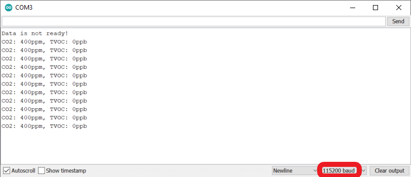

# Test CCS811 Instructions (ESP8266 board)

The test code provided [here](test_CCS811.ino) will read from the CCS811 CO2 and TVOC sensor every second and print the results to the serial output.

1. Connect the Arduino board and the CCS811 sensor (see **Step 5** in the [setup instructions](../../docs/arduino_setup.md)) to your computer using the micro USB cord.

2. Open the test_CCS811.ino file from this directory in the Arduino IDE.

3. Upload the code to the Arduino.

4. Open the Serial Monitor.  Make sure the baud rate is set to 115200, since that is what the code uses.

