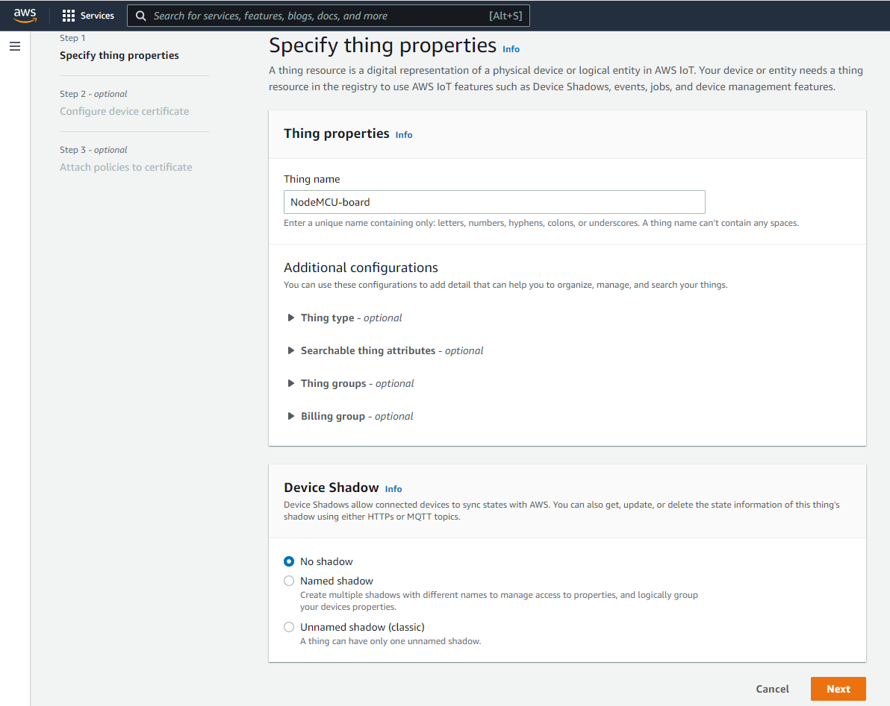
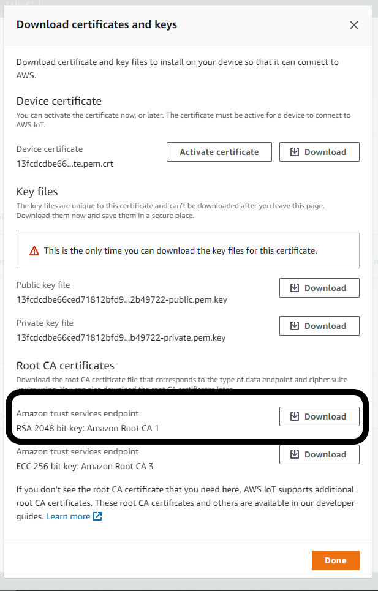

# Test MQTT Instructions

The test code provided [here](test_mqtt.ino) will send MQTT messages to an AWS topic every 10 seconds.

1. Go to the IoT Core console on AWS.  On the left hand side, select *Things* from the **Manage** menu.

2. Select **Create things**.  Create a single thing, and give it a unique name. Do not create a certificate.

3. Select the thing you just created, and go to *Certificates*.  Click on **Create Certificate**, then download the RSA 2048 bit key: Amazon Root CA 1.

4. Go to the IAM console on AWS.  Go to Users, and click **Add users**.  Give the new user programatic access and AdministratorAccess.  Make sure you download the security credentials after creating the new user.

5. Open the arduino_secrets.h file in this directory.  In there, you will need to fill out the name and password of the WiFi network you want to connect the Arduino to, as well as the AWS endpoint and key/secret key from step 4 (the downloaded user credentials).
Find the AWS endpoint by going to the IoTCore console, then go to Settings.

6. Open the test_mqtt.ino file from this directory in the Arduino IDE.  There are 3 variables to edit here:
* aws_region: the region you created the thing in
* aws_topic: for testing purposes, keep this as "arduino/simple"
* ca: the certificate downloaded from step 3.

7. Download the required libraries: for each link below, download the zip file, and upload it to the Arduino IDE.
* https://github.com/odelot/aws-mqtt-websockets/releases/tag/v1.3.0
* https://github.com/odelot/aws-sdk-arduino
* https://github.com/Links2004/arduinoWebSockets/releases/tag/2.3.5
* https://github.com/knolleary/pubsubclient/releases/tag/v2.8
To upload these libraries, go to Sketch->Include Library->Add .ZIP Library.

8. Go to the AWS IoTCore console, and click on the MQTT test client.  Subscribe to the topic set in the code in step 7.

9. Connect the NodeMCU board to your computer with a micro USB connector.

10. Upload the code to the board.

11. Open the Serial Monitor.  Make sure the baud rate is set to 115200, since that is what the code uses.

## Notes
* This code is still a bit buggy: it tends to fail to connect to AWS for some time, but I have found that if you let it run for awhile, it will sort itself out.  I have isolated the problem to line 110 in the code, which is a call to a library function I didn't get a chance to inspect.  If you see Fatal Exception 9 or 28 on the serial output, that is associated with this issue.
