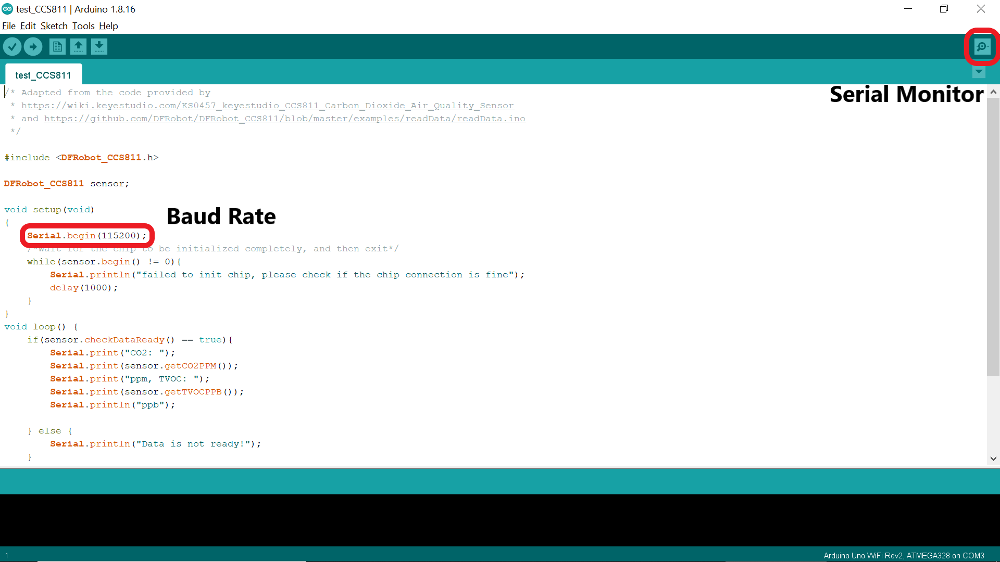

# Test Get Time Instructions

The test code provided [here](test_get_time.ino) will connect to a specified WiFi network, send a request for a timestamp to an NTP server every 10 seconds, and print the timestamps in Unix format to the serial output.

1. Connect the Arduino board to your computer using the USB blaster cord.

2. Fill in the file arduino_secrets.h with the WiFi network and password to connect the Arduino to.

3. Open test_get_time.ino from this directory in the Arduino IDE.

4. Upload the code to the Arduino.

5. Open the Serial Monitor.  Make sure the baud rate is set to 115200, since that is what the code uses.

